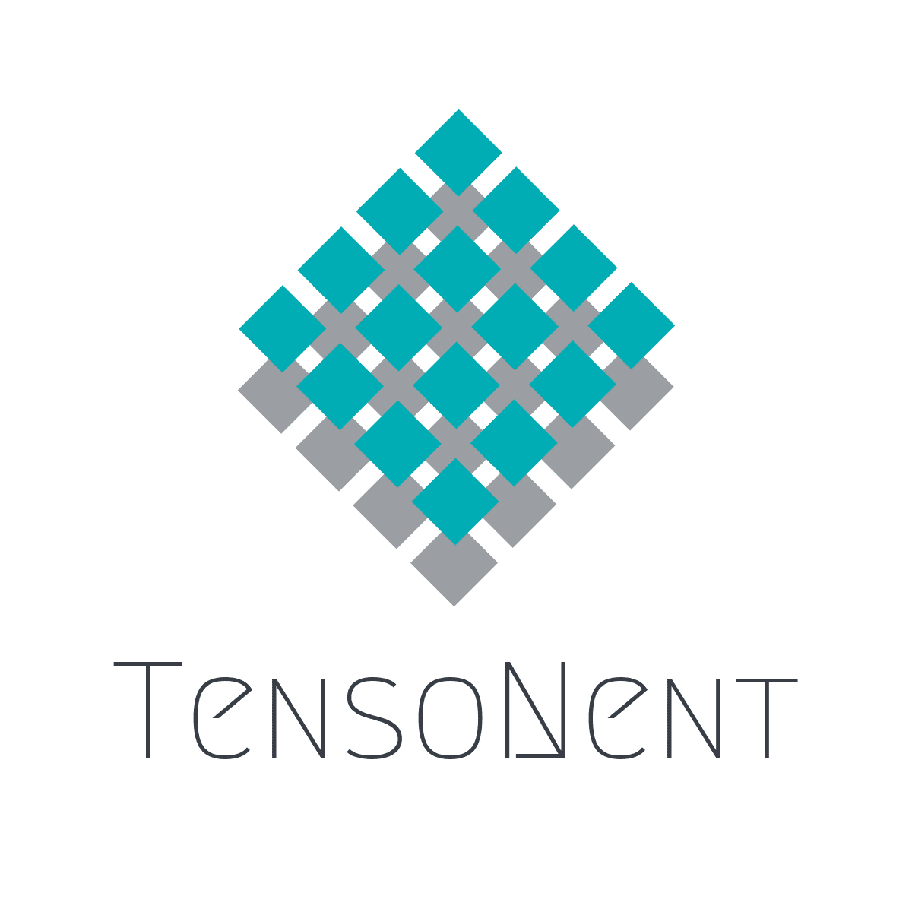

[](https://travis-ci.com/TensoNent/tensonent)
[](https://www.codefactor.io/repository/github/tensonent/tensonent)

# TensoNent
TensoNent is a python module containing collection of tensor decomposition methods.

Website: [https://github.com/TensoNent](https://github.com/TensoNent)


## Installation

Dependencies:
1. Python >= 3.7
2. Numpy >= 1.17.4
3. PyTest >= 5.3.2
4. PyLint >= 2.4.4

If you already have working installations of dependencies, you can install tensonent using **pip**:
```text
$ pip install tensonent
```
To update TensoNent to the latest version, add ```--upgrade``` flag to the command above.


## Development

We welcome new contributors of all experience level. If you want to contribute to TensoNent,
be sure to review the [contributing guideline](CONTRIBUTING.md).


### Important links

* Official source code repository: [https://github.com/TensoNent/tensonent](https://github.com/TensoNent/tensonent)
* Download releases: [https://pypi.org/project/tensonent/](https://pypi.org/project/tensonent/)
* Issue tracker: [https://github.com/TensoNent/tensonent/issues](https://github.com/TensoNent/tensonent/issues)


### Source code

You can check the latest sources with the command below:
```text
$ git clone https://github.com/TensoNent/tensonent.git
```


## Authors

* **Milad Sadeghi.DM** - _Initial work_ - [EverLookNeverSee](https://github.com/EverLookNeverSee)

See also the list of [contributors](https://github.com/TensoNent/tensonent/graphs/contributors) who participated in this project.


## License

This project is licensed under the [MIT License](https://choosealicense.com/licenses/mit/) - see the [LICENSE](LICENSE)
file for details.


## Communication

* Email address: [TensoNent@Gmail.com](mailto:TensoNent@Gmail.com)
* Telegram group: [https://t.me/TensoNent](https://t.me/TensoNent)
